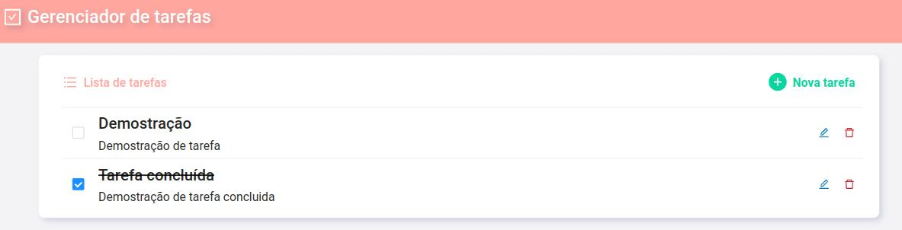
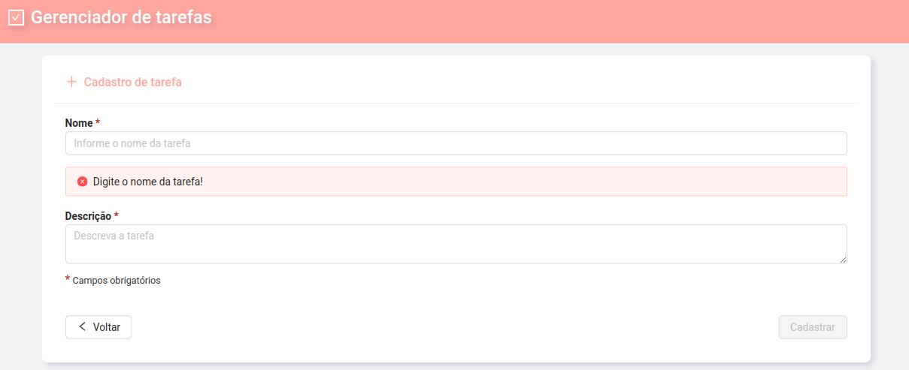

# Gerenciador de tarefas





> Um gerenciador de tarefas, crud simples que permite: listar, criar, atualizar e apagar tarefas. Uso do <a href="https://ng.ant.design/docs/introduce/en">🔗 NG-ZORRO</a> para pop-up de confirmação de cada etapa.

## 🚀 Instalando gerenciador-de-tarefas

Para instalar o gerenciador-de-tarefas, siga estas etapas:

Linux, macOS e Windows:
```
yarn install
```
```
ng serve
```

## 📫 Contribuindo para gerenciador-de-tarefas  

Para contribuir com o conversor de moedas, siga estas etapas:

1. Bifurque este repositório.
2. Crie um branch: `git checkout -b <nome_branch>`.
3. Faça suas alterações e confirme-as: `git commit -m '<mensagem_commit>'`
4. Envie para o branch original: `git push origin gerenciador-de-tarefas / <local>`
5. Crie a solicitação de pull.

## 🤝 Colaboradores

<table>
  <tr>
    <td align="center">
      <a href="#">
        <br>
        <sub>
          <b>Madalena Campos</b>
        </sub>
      </a>
    </td>
  </tr>
</table>

[⬆ Voltar ao topo](#gerenciador-de-tarefas)<br>
